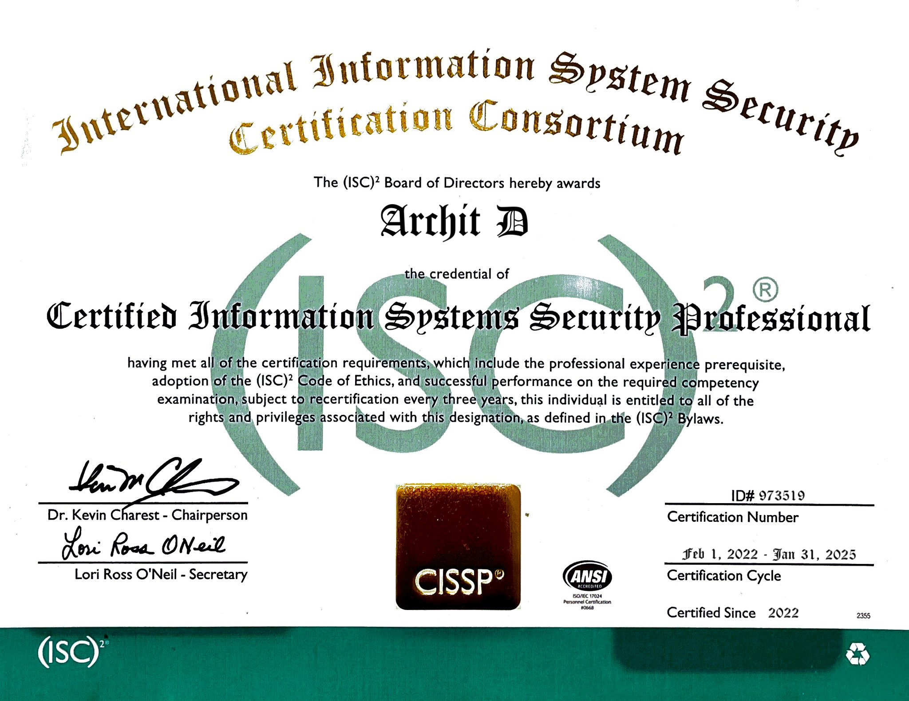

<!--
  File: cissp-verified-certificate-record.html
  Format-Version: 1.0.0
  Registry-Source: ISC2-Registry-Gateway
  Certificate-Status: Archived
  Exported-On: 2025-01-01T00:00:00Z
  Render-Mode: readonly
-->

# 🛡️ Certified Information Systems Security Professional (CISSP)

%C2%B2-blue?logo=verizon)

---

## 📘 Certification Overview

This repository, `isc2-cissp-credential-log`, is an **archived snapshot** of the CISSP credential issued to **Archit D** by the *(ISC)² Board of Directors*.  
This designation confirms successful compliance with the following certification criteria:

- Minimum verified cybersecurity experience  
- Agreement to the (ISC)² Code of Ethics  
- Passed competency-based CISSP examination  
- Subject to 3-year recertification cycle  

---

## 🗓 Credential Metadata

- **Certification Title:** Certified Information Systems Security Professional (CISSP)  
- **Issued By:** International Information System Security Certification Consortium (ISC²)  
- **Certification ID:** 973519  
- **Certified Individual:** Archit D  
- **Certified Since:** February 1, 2022  
- **Certification Cycle:** Feb 1, 2022 – Jan 31, 2025  
- **Credential Status:** Previously Active  
- **Snapshot Source:** GitHub Public Archive  
- **Record ID:** `GH-Verified-Snapshot-973519`  

---

## 📚 Core Domains Validated

- 🔐 Security and Risk Management  
- 🔒 Asset Security  
- 🧩 Security Architecture and Engineering  
- 🌐 Network Security  
- 🔑 Identity and Access Management (IAM)  
- 📊 Security Assessment & Testing  
- 🚨 Security Operations  
- 💻 Software Development Security

---

## 🖼️ Certificate Preview

> The (ISC)² Board of Directors hereby awards **Archit D** the credential of  
> **Certified Information Systems Security Professional**, having met all certification requirements, including:
>
> - Verified professional experience  
> - Acceptance of the (ISC)² Code of Ethics  
> - Successful completion of the CISSP exam  
>
> 🖋 **Signatories:**  
> Dr. Kevin Charest – Chairperson  
> Lori Ross O'Neil – Secretary

---

## 📁 Repository Purpose

This repository is a digital preservation node for one-time issuance of a CISSP credential under the terms and definitions of (ISC)² at the time of certification.  
It is **not** affiliated with or endorsed by (ISC)².

All contents are cryptographically timestamped and version-controlled to ensure integrity.

---

## 📁 Repository Structure

- `CISSP-Certificate-ArchitD-973519.JPEG` – Scanned certificate archive  
- `cissp_metadata.json` – Machine-readable metadata file  
- `LICENSE` – Legal usage and redistribution terms  
- `.gitignore` → Credential-first file filtering  
- `.nojekyll` → Maintains static HTML and raw view on GitHub Pages

---

## 🔐 Repository Signature

> **Commit Reference:** `Signed archival snapshot – credential certificate + metadata embedded`  
> **Commit Mode:** Timestamped (GitHub signed)  
> **Snapshot ID:** `GH-Verified-Snapshot-973519`

---

## ⚠️ License Notice

All content in this repository is protected by a **restrictive digital license**.  
No files may be reused, downloaded, referenced, reproduced, automated scraped, or linked for external verification or redistribution without direct written consent of the copyright owner.

See the full [LICENSE](./LICENSE) file for details.
